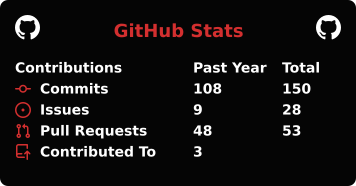
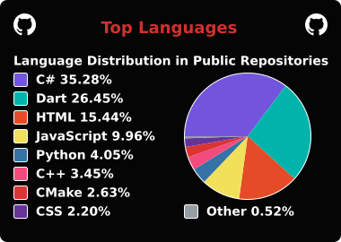
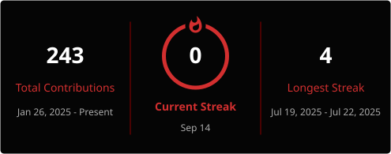

  

  

## 💫 Sobre mí

Estudiante de Desarrollo de Software apasionado por el **backend**, la **Inteligencia Artificial** y la construcción de soluciones prácticas a través del código.

- 🔭 Actualmente enfocado en proyectos de backend con .NET y Python
- 🌱 Aprendiendo constantemente sobre IA y arquitectura de software
- 💬 Pregúntame sobre C#, Python, bases de datos y APIs
- ⚡ Fun fact: me gusta convertir problemas complejos en soluciones simples

## 🌐 Conecta conmigo

  
  

## 💻 Tech Stack

**Lenguajes**

**Frameworks & Plataformas**

**Bases de Datos**

**Herramientas**

## 📊 GitHub Stats

  
  

  

## 🏆 GitHub Trophies

  

## 📌 Repo Destacado

  

### ✍️ Frase random para devs

  

---

  

### 🐍 Contribution Snake

<picture>
  <source media="(prefers-color-scheme: dark)" srcset="https://raw.githubusercontent.com/WandrysFG/WandrysFG/output/github-snake-dark.svg" />
  <source media="(prefers-color-scheme: light)" srcset="https://raw.githubusercontent.com/WandrysFG/WandrysFG/output/github-snake.svg" />
  
</picture>

  

